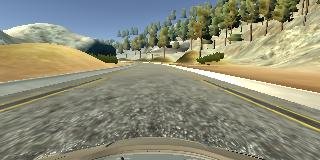

#**Behavioral Cloning**

###**Behavioral Cloning Project**

The goals for this project are the following:

* Use the simulator to collect data of good driving behavior
* Build, a convolution neural network in Keras that predicts steering angles from images
* Train and validate the model with a training and validation set
* Test to make sure model successfully drives around track one without leaving the road
* Summarize the results with a written report

--

###Prerequisites

* Keras 2 API
* Tensorflow Backend
* AWS GPU Instance for training data
* [NVIDIA's model](http://images.nvidia.com/content/tegra/automotive/images/2016/solutions/pdf/end-to-end-dl-using-px.pdf) for a working CNN model
* Udacity's Self Driving Car simulator

--

###Project Files & Folder Structure

This project incldes the following files & folders

> model.py => script to create and train the final model
>
> drive.py => Original file from Udacity to drive autonomously
>
> **primitive** => a model with only flatten layer just to establish a working setup
> > primitive.py
> >
> > model.h7
> >
> > [Resultant Video - Car going in circles :-) ](https://youtu.be/XlR6suUvaVE)
>
> **first-attempt**
> > model.py  => trial 1 for a model based on NVIDIA & Keras 2
> >
> > model-architecture.md
> >
> > data-distribution.png => histogram showing data distribution
> >
> >
> > [Video - Properly driving on track 1](https://youtu.be/UUspdDIenkw) -- uploaded to youtube
> 	
> **final-attempt**
> >
> > model-7epoch.h5.zip => Working compiled model
> >
> > model.py => Final Model
> >
>
> model.h5.zip => Compiled model, same as in final-attempt folder
>
> model.py => Same as in final-attempt folder
>
> model.png => Keras model visualization

--


###Model Architecture and Training Strategy

####1. An appropriate model architecture has been employed

The model used here is completely based on NVIDIA's paper with added Dropout layers between the fully connected layer.


####2. Attempts to reduce overfitting in the model

The model includes dropouts in between the fully connected layers and the number of epoch was set to 7 where the loss reaches its minimum to avoid overfitting (model.py lines 21).

The model was trained and validated on different data sets - including driving the car in reverse in the simultor, driving data from Track 2 etc. The model was tested by running it through the simulator and ensuring that the vehicle could stay on the track.

####3. Model parameter tuning

The model parameters were tuned or optimized by Adam optimizer with its defaults values

```
keras.optimizers.Adam(lr=0.001, beta_1=0.9, beta_2=0.999, epsilon=1e-08, decay=0.0)
```


####4. Appropriate training data

Managed collect quite a number of training data from the simulator also made attempts to do image preprocessing by cropping and mirroring the images.

###Model Architecture and Training Strategy

####1. Solution Design Approach

The original goal for this model architecture was to build a multi-layer convolutional network that can be trained and eventually used to autonomously drive the car in a simulator.

NVIDIA's end-to-end learning model for self driving car was a established working model that was proven to work. In this project I have made attempt to improve or fine tune the model by making slight modifications, like, adding Dropouts and potential add or remove any layers to improve accuracy.

Keras 2 API provide nice features to split the data between training any validation. I have compiled the Keras model using "Mean Square Error" loss function and inbuilt **Adam** optimizer to optimize the models using default values, mentioned above.

```
model.compile(loss='mse', optimizer='adam')
```

To combat the overfitting, I have added One droppout layer bettween the convolutional layers and the fully connected layers also the epoch was set to 7 iterations.


At the end of the process, the vehicle is able to drive autonomously around the track without leaving the road.

####2. Final Model Architecture

The final model architecture (model.py lines 18-24) consisted of a convolution neural network with the following layers and layer sizes ...

```
Layer (type)                 Output Shape              Param #   
=================================================================
cropping2d_2 (Cropping2D)    (None, 70, 220, 3)        0         
_________________________________________________________________
conv2d_6 (Conv2D)            (None, 35, 110, 24)       1824      
_________________________________________________________________
activation_10 (Activation)   (None, 35, 110, 24)       0         
_________________________________________________________________
max_pooling2d_6 (MaxPooling2 (None, 34, 109, 24)       0         
_________________________________________________________________
conv2d_7 (Conv2D)            (None, 17, 55, 36)        21636     
_________________________________________________________________
activation_11 (Activation)   (None, 17, 55, 36)        0         
_________________________________________________________________
max_pooling2d_7 (MaxPooling2 (None, 16, 54, 36)        0         
_________________________________________________________________
conv2d_8 (Conv2D)            (None, 8, 27, 48)         43248     
_________________________________________________________________
activation_12 (Activation)   (None, 8, 27, 48)         0         
_________________________________________________________________
max_pooling2d_8 (MaxPooling2 (None, 7, 26, 48)         0         
_________________________________________________________________
conv2d_9 (Conv2D)            (None, 7, 26, 64)         27712     
_________________________________________________________________
activation_13 (Activation)   (None, 7, 26, 64)         0         
_________________________________________________________________
max_pooling2d_9 (MaxPooling2 (None, 6, 25, 64)         0         
_________________________________________________________________
conv2d_10 (Conv2D)           (None, 6, 25, 64)         36928     
_________________________________________________________________
activation_14 (Activation)   (None, 6, 25, 64)         0         
_________________________________________________________________
max_pooling2d_10 (MaxPooling (None, 5, 24, 64)         0         
_________________________________________________________________
flatten_2 (Flatten)          (None, 7680)              0         
_________________________________________________________________
dropout_1 (Dropout)          (None, 7680)              0         
_________________________________________________________________
dense_6 (Dense)              (None, 1164)              8940684   
_________________________________________________________________
activation_15 (Activation)   (None, 1164)              0         
_________________________________________________________________
dense_7 (Dense)              (None, 100)               116500    
_________________________________________________________________
activation_16 (Activation)   (None, 100)               0         
_________________________________________________________________
dense_8 (Dense)              (None, 50)                5050      
_________________________________________________________________
activation_17 (Activation)   (None, 50)                0         
_________________________________________________________________
dense_9 (Dense)              (None, 10)                510       
_________________________________________________________________
activation_18 (Activation)   (None, 10)                0         
_________________________________________________________________
dense_10 (Dense)             (None, 1)                 11        
=================================================================
Total params: 9,194,103
Trainable params: 9,194,103
Non-trainable params: 0
_________________________________________________________________
```


Here is a visualization of the architecture  [Keras Model Visualization](./model.png)


####3. Creation of the Training Set & Training Process

In the _**primitive attempt**_, I purposefully collected data by driving car in zig-zag manner hoping there will be more data points with non-zero steering angle and the model would strive to stick to the center always. However, I was proved otherwise as the car started to circle around continuously, as you see in the video here.

[](http://www.youtube.com/watch?v=XlR6suUvaVE)


Having a good data set is very critical training a nueral network. To capture good driving behavior, I first recorded two laps on track one using center lane driving. Here is an example image of center lane driving:



I then recorded the vehicle recovering from the left side and right sides of the road back to center so that the vehicle would learn to swerve back to the center of the lane if it gets drifted. Below are some of of the samples.

[Swerve from Left](./images/swerve-from-left.mp4)

[Swerve from Right](./images/swerve-from-right.mp4)


I tried creating datasets from Track 2, attempted recommendations from [David](http://davidaventimiglia.com/carnd_behavioral_cloning_part1.html) on some image flipping, shadowing etc. Getting more and more variations in the image sample for Training the network is the way to go a successfully trained model. However the model from **final-attempt** folder agains the Udacity's Training Dataset seems to work magical for me.

I have tried to document some of my failed attempts in the RTF file, showing only the compilations.

Below is the recording from the working setup.

<iframe width="560" height="315" src="https://www.youtube.com/embed/QxI3tvIn0Ms" frameborder="0" allowfullscreen></iframe>

---
